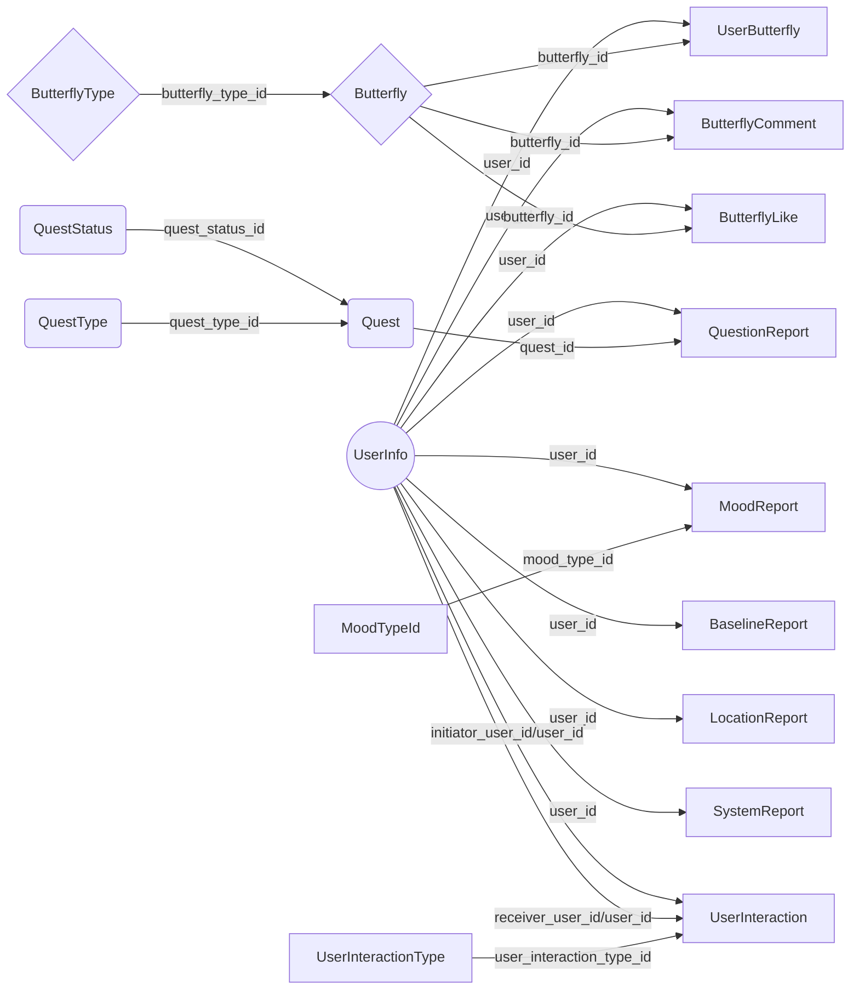

# Welcome to ARORA Server
This is a server project based on [**Django REST Framework**]([https://www.django-rest-framework.org/](https://www.django-rest-framework.org/)).

# Package Dependency
1. Django 2.2.1
2. djangorestframework 3.9.2
3. djangorestframework-jwt 1.11.0
4. rest-condtion 1.0.3

# How to Set Up the Server
 1. Get the project from Github

 2. Go to /root_dir/arora/env, then run command: source ./active to active virtual environment. 

 3. Back to /root_dir

 4. Create migration files for building database, sudo python3 manage.py makemigrations

 5.  Create a brand new database, sudo python3 manage.py migrate.

 6.  Create a super user for the first step to access database, sudo python3 manage.py createsuperuser.

 7.  Run server, sudo python3 runserver, or you can assign customized IP address and port here, sudo python3 runserver 127.0.0.1 8000.

 8.  Open browser, go to 127.0.0.1:8000/admin to access admin site.

 9.  Log in with your super user account.

 10.  Now, you can manage database by your super user account. And we done. Have fun!

**Note:** 
1.	Using admin site is a optional way to manage your database. 
2.	 If you meet any problem when you do the above process, please make sure nothing wrong with your migration files. [Learn more.](https://github.com/LooDaHu/ARORA_General_Introduction/blob/master/README.md)
# Models

 1. UserInfo
		|--> user_info_id *(integer)*	
		|--> user_id *(integer)*	
		|--> user_name_of_strength* *(string)*  
		|--> user_created_at *(datetime)* 
		|--> user_current_mood* *(integer)*	  
		|--> user_current_mood_updated* *(datetime)* 
		|--> user_current_location_lat* *(decimal)*
		|--> user_current_location_long* *(decimal)*  
		|--> user_current_location_updated* *(datetime)* 
		|--> user_current_butterfly* *(integer)*	 
		|--> user_pollen* *(integer)*	
		|--> user_points* *(integer)*	
		**|--> username** (Django bulit-in field) *(string)*  
		**|--> email** (Django bulit-in field) *(string)*  
		**|--> password** (Django bulit-in field) *(string)*  
		
 2. ButterflyType
		|--> butterfly_type_id *(integer)*	
		|--> butterfly_type_description* *(integer)*	
		|--> butterfly_type_image* *(string)*  
			 
 3. Butterfly
		 |--> butterfly_id *(integer)*
		 |--> butterfly_type_id* *(integer)*
		 |--> butterfly_create_at *(datetime)* 
		 
 4. UserButterfly
		 |--> user_butterfly_id *(integer)*
		 |--> butterfly_id* *(integer)*
		 |--> time_caught *(datetime)* (Record the date time when it is created)
		 |--> user_id* *(integer)*
		 
 5. ButterflyLike
		 |--> butteefly_like_id *(integer)*
		 |--> butterfly_id* *(integer)*
		 |--> user_id* *(integer)*
		 |--> like_created_at *(datetime)* 
		 
 6. ButterflyComment
		 |--> butterfly_comment_id  *(integer)*
		 |--> butterfly_id*  *(integer)*
		 |--> user_id*  *(integer)*
		 |--> comment_created_at *(datetime)* 
		 |--> comment_text* *(string)*  
		 
 7. BaselineReport
		 |--> baseline_report_id *(integer)*
		 |--> user_id* *(integer)*
		 |--> baseline_report_created_at *(datetime)* 
		 |--> baseline_report_results* *(string)*  
		 
 8. LocationReport
		 |--> location_report_id *(integer)*
		 |--> location_report_lat* *(decimal)*  
		 |--> location_report_long* *(decimal)*  location_report_create_at
		 |--> location_report_create_at *(datetime)* 
		 |--> user_id* *(integer)*

 9. MoodType
		 |--> mood_type_id *(integer)*
		 |--> mood_type_description* *(string)*  
		 
 10. MoodReport
			|--> mood_report_id *(integer)*
			|--> mood_report_created_at
			|--> user_id* *(integer)*
			|--> mood_type* *(integer)*
			|--> user_text* *(string)*  
					 
 11.  Phrase
			 |--> phrase_id *(integer)*
			 |--> phrase_english_text* *(string)*  
			 |--> phrase_indigenous_text* *(string)*  
			 
 12.  QuestType
			  |--> quest_type_id *(integer)*
			  |--> quest_type_description* *(string)*  
			  
 13. QuestStatus
			  |--> quest_status_id *(integer)*
			  |--> quest_status_description* *(string)*  
			  
 14. Quest
			  |--> quest_id *(integer)*
			  |--> quest_type_id* *(integer)*
			  |--> quest_status_id* *(integer)*
			  
 15. QuestReport
			 |--> quest_report_id *(integer)*
			 |--> quest_id* *(integer)*
			 |--> user_id* *(integer)*
			 |--> quest_started_at *(datetime)* 
			 |--> quest_ended_at *(datetime)* (Record the date time when it is updated)
			 
 16. SystemReport
			 |--> system_report_id *(integer)*
			 |--> user_id* *(integer)*
			 |--> power_level* *(integer)*
			 |--> request_latnecy* *(string)*  
			 |--> system_report_created_at *(datetime)*
			 
 17. UserInteractionType
			 |--> user_interaction_type_id *(integer)*
			 |--> user_interaction_description* *(string)*  
			 
 18. UserInteraction  
			 |--> user_interaction_id *(integer)*
			 |--> user_interaction_created_at *(datetime)*
			 |--> initator_user_id* *(integer)*
			 |--> receiver_user_id* *(integer)*
			 |--> user_interaction_type_id* *(integer)*
			 |--> user_interaction_content* *(string)*  
			 
 **Note:**
 1. This is a liitle special for creating a new user, due to use default django user model:
	 >Method: POST
	 >DATA in JSON:	{  "username": "< user_name >", "password": "< password >", "email": "< email >" }
	 
 2. The server returns all fields in the models back when it gets a **GET** request.
 3. The fields in the models wtih **star** notation are entirely requried at **POST/PUT** request.  
 4. The fields in the models wtih **star** notation are partially requried at **PATCH** request.  
 5. There are two situation for non-requried field( the fields without **star** notation):
		(1) The field is a prime key, such as, user_info_id, quest_id, and mood_report_id.
		(2) The field is a date time field which is created or updated, such as, time_caught, location_report_create_at, and quest_ended_at. 
 6. The source code reserves all the right for the final explanation.

# Endpoints URL 

**General URL Principle:** 
POST:  < DOMAIN_NAME or IP_ADDRESS >/< RESOURCE_NAME >
	e.g: http://127.0.0.1:8000/userinfo  

GET:  < DOMAIN_NAME or IP_ADDRESS >/< RESOURCE_NAME >/< RETRIEVED_ITEM_ID >
	e.g: http://127.0.0.1:8000/userinfo/1

GET(All items):  < DOMAIN_NAME or IP_ADDRESS >/< RESOURCE_NAME s>/< RETRIEVED_ITEM_ID >
	e.g: http://127.0.0.1:8000/quests	http://127.0.0.1:8000/phrases

PUT:  < DOMAIN_NAME or IP_ADDRESS >/< RESOURCE_NAME >/< UPDATED_ITEM_ID >
	e.g: http://127.0.0.1:8000/quest/1

PATCH:  < DOMAIN_NAME or IP_ADDRESS >/< RESOURCE_NANE >/< UPDATED_ITEM_ID >
	e.g: http://127.0.0.1:8000/userinteraction/1

DELETE:  < DOMAIN_NAME or IP_ADDRESS >/< RESOURCE_NAME >/< DELETED_ITEM_ID >
	e.g: http://127.0.0.1:8000/userbutterfly/1

| Model  Name    | Resource Name                           |Accept Method      | 
|----------------|-------------------------------|-------------------|
|UserInfo        |userinfo| POST; GET; PUT; PATCH |
|UserInfo        |nearbyusers| GET |
|ButterflyType   |butterflytype| POST; GET; PUT; PATCH |
|Butterfly       |butterfly| POST; GET; PUT; PATCH |
|UserButterfly   |userbutterfly|POST; GET; PUT; PATCH; DELETE|
|ButterflyLike   |butterflylike|POST; GET; PUT; PATCH|
|ButterflyComment|butterflycomment|POST; GET; PUT; PATCH|
|BaselineReport  |baselinereport|POST; GET; PUT; PATCH|
|LocationReport  |locationreport|POST; GET; PUT; PATCH|
|MoodType      |moodtype|POST; GET; PUT; PATCH|
|MoodReport      |moodreport|POST; GET; PUT; PATCH|
|Phrase          |phrase|POST; GET; PUT; PATCH|
|Quest       |quest|POST; GET; PUT; PATCH|
|QuestType       |questtype|POST; GET; PUT; PATCH|
|QuestStatus     |queststatus|POST; GET; PUT; PATCH|
|QuestReport     |questreport|POST; GET; PUT; PATCH|
|SystemReport    |systemreport|POST; GET; PUT; PATCH|
|UserInteractionType|userinteractiontype|POST; GET; PUT; PATCH|
|UserInteraction    |userinteraction|POST; GET; PUT; PATCH|

Here I recommend you use [POSTMAN](https://www.getpostman.com/), a API development environemnt, to test the endpoints and know how to access those endpoints more directly.  And I have a collection contains all useage of the endpoints, which could let us have a easier life.
Sharing Link: https://www.getpostman.com/collections/921a12a8fa5a925e0c28

A Example of How to Use:
1.  Afer you have installed and opened POSTMAN. Click **Import** button. Let's start importing the collection.

2.  Choose  **Import From Link**, then Copy the **Sharing Link** to it. 

3. After you sucessfully import the collection, you can see the pop-up at the downside.

4.  Let's try to create a user. Of cource, please make sure the server is running properly. And the set-up of the request should be correct aslo.

5. After every thing is ok, Click the **Send** button. And we get a response shows the user_id of our new user back.

# Foreign Key Relationship Map

**Note:** 
All validation part depends on this foreign key relationship map.
Example:
If we want to create a new quest, there are two fields to be validated, **quest_status_id** and **quest_type_id**. Assuming the incoming quest_status_id is 100, however, this is no item whose **quest_status_id** is 100, creating is fail. And it returns a **409 CONFLICT** error. 

# Token

 - Token system in this server is based on [REST framework
   JWT](http://getblimp.github.io/django-rest-framework-jwt/).
 - Any request with the token takes a user object to the server.
 - For more information, [here](https://github.com/LooDaHu/ARORA_General_Introduction/blob/master/README.md). 

## Get a Token
>URL: http://127.0.0.1:8000/api-token-auth/
> Method: POST
> Data in JSON: { "username":"< user_name >", "password":"< password >"}

## Verify a Token
>URL: http://127.0.0.1:8000/api-token-verify
> Method: POST
> Data in JSON: { "token":"JWT < token_to_be_refresh >"}

## Refresh a Token
>URL: http://127.0.0.1:8000/api-token-refresh
> Method: POST
> Data in JSON: { "token":"JWT < token_to_be_refresh >"}
> Note: '[JWT_ALLOW_REFRESH](http://getblimp.github.io/django-rest-framework-jwt/#additional-settings)' should be True to enable [refreshing token](http://getblimp.github.io/django-rest-framework-jwt/#refresh-token).

# Contact
If you have any question about the above content, be free to contact me.
>Developer: Jinming Yang
>Email: jy345@nau.edu
>Github: @LooDaHu
>WeChat: a651120561

And here is a simple tutorial to fast set-up about [Django-REST-framework and Retrofit](https://github.com/LooDaHu/ARORA_General_Introduction/blob/master/README.md). 

